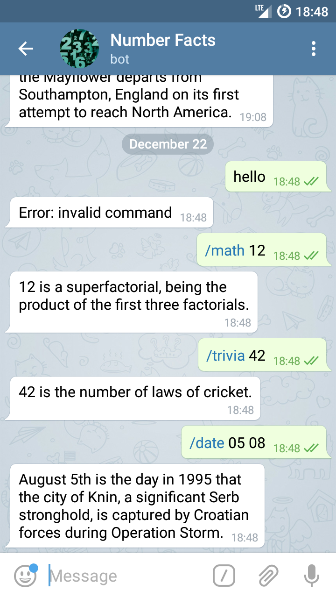

# Numbers Bot [@number_facts_bot](https://t.me/number_facts_bot)

Бот для телеграма, который выводит факты о числах.

### Функциональность
Бот может выводить математические факты о числах (/math), "интересные" факты (/trivia) и информацию об определенной дате (/date)

<p align="center">
  
</p>

### Используемые технологии
* Для работы с Telegram API используется библиотека [org.telegram:telegrambots](https://github.com/rubenlagus/TelegramBots)
* Данные о числах получаем из [NumbersAPI](http://numbersapi.com/)
* Отправка HTTP-запросов реализована с помощью [Unirest](http://unirest.io/java.html)

### Сборка

Для корректной работы бота необходимо создать файл ```application.properties``` с ключами ```telegram_token``` и ```help_message```

Проект собирается с помощью Gradle
<pre>
gradle clean build
</pre>

После сборки полученный jar в папке ```build/libs``` и ```application.properties``` необходимо положить в одну директорию и запустить как обычный jar-файл.
